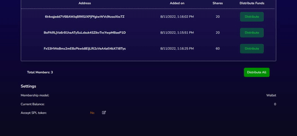

# Accept SPL tokens

As previously mentioned, while creating your Hydra wallet, you can set it to accept an SPL token in addition to SOL. This implies that you have the ability to fund and distribute SPL to your members.

You may change this setting later from the wallet details page, so don't worry if you forgot to do it when you created your wallet. Just click on the _Edit_ icon next to "Accept SPL token".

A small form will be revealed where you can enable the "Accept SPL Tokens" checkbox, enter the public key of the SPL token mint, and click "Update" to accept SPL tokens.

