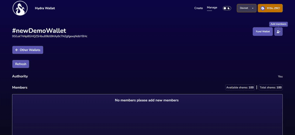

# Adding members

Adding members to your Hydra wallet is pretty straightforward; you click the "Add members" icon at the top right of the wallet details page and a modal will show up where you can enter the details of the new member, which include the public key of some wallet in case of **Wallet membership** or the public key of an NFT mint in case of **NFT membership.**

You should also specify the number of shares the new member gets; notice that you can only distribute funds once the sum of all member shares is equal to the total number of shares of the wallet. Also, the shares of the new member cannot exceed the available shares of the wallet.

