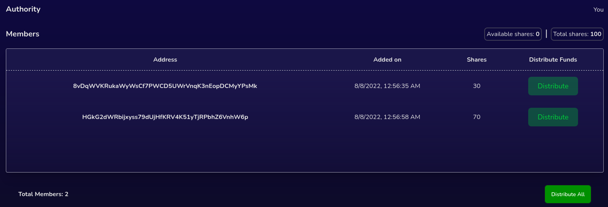

# Distributing funds

There are two ways in which you can distribute funds to the members of the wallet:

* Distribute to each member individually
* Distribute to all members at once

Click on "Distribute" next to the member you want to distribute funds to or click on "Distribute All" to distribute funds to all members and then accept the transaction through your wallet provider to proceed.

