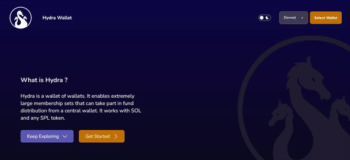
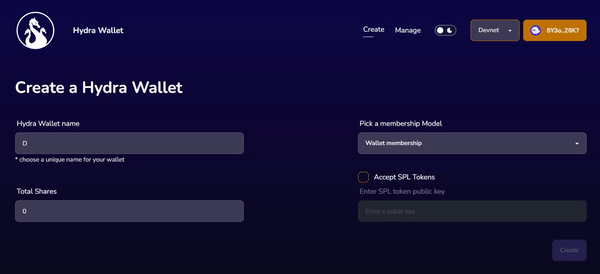

# Wallet Creation

## Connecting your wallet

To create a new Hydra wallet, you need to connect your Solana wallet. On the landing page of the application, click on "Get Started" or "Select Wallet" in the top right corner to connect your wallet. You can also change the connected cluster through the selection box in the top right corner.

Once your wallet is connected, you will be able to see two links in the navigation bar: **Create** and [**Manage**](managing-your-wallet.md). Click on **Create** to navigate to the wallet creation page.

## Wallet creation page

On the wallet creation page, you have to specify a _unique name_ for your Hydra wallet, the _membership model_, and the _total number of shares_.

The total number of shares is needed for fund distribution. The sum of the shares allocated to each member of the wallet should be equal to the total number of shares specified when it was created.

You can also specify whether your Hydra wallet accepts a certain SPL token by checking the "Accept SPL Tokens" checkbox and providing the mint public key of the SPL token.

Once your wallet configuration is ready, click on "Create" to begin creating your wallet, you will be prompted to sign the transaction using your wallet provider (e.g.: Phantom wallet).

When wallet creation is successful, you will be redirected to the [wallet details page](managing-your-wallet.md#checking-wallet-details) where you can manage your wallet, send funds to it, and distribute funds to the members of the wallet. The next sections describe these actions in detail.
